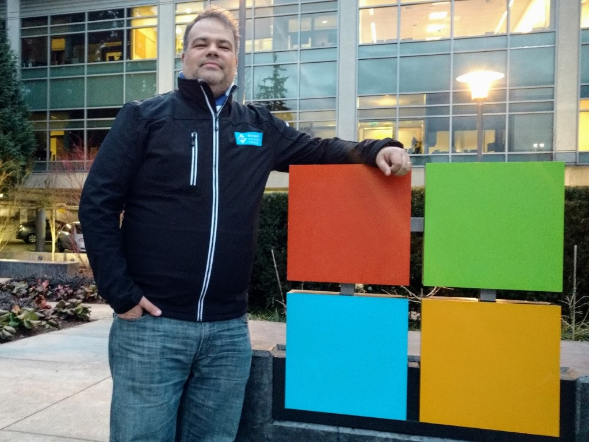

### Hi there 👋

My name is Emmanuel G. Brandão, or only Brandão. I'm a [DevOps Consultant](https://www.linkedin.com/in/egomesbrandao/) at [esx](https://www.linkedin.com/company/esx/) from Brazil!
I'm a [Microsoft MVP](https://mvp.microsoft.com/en-us/PublicProfile/5002135) on Developer Technologies category.

- 🔗 I have personal site, on (Not exactly yet) Github Pages at [https://egomesbrandao.com.br](https://egomesbrandao.com.br)

- 📝 I also have a blog at [https://deliveringsoftware.com.br](https://deliveringsoftware.com.br)

- 📹 Subscribe on [Delivering Software channel](https://www.youtube.com/channel/UCv4oKgRNdl2i9VWdZtyXwpw) @ YouTube

- 🐦 [@egomesbrandao](https://twitter.com/egomesbrandao)
- 💬 [Telegram](https://t.me/egomesbrandao)

- 📮 You can also send me an [email](mailto:egomesbrandao@gmail.com)

- 🔭 I'm currently working on a Powershell tool to bring security as code to Azure DevOps: [tsc](https://github.com/deliveringsoftware/tsc)

- 🌱 I’m currently learning more about @Github
- 💬 Ask me anything about DevOps on the channels above
- 😄 Pronouns: He/him
- ⚡ Fun fact:
    - I like SciFi, specially Star Trek 🎞
    - 📸 I like photography, I need to publish a more pro-phots album, but if you want to see some here is my [Instagram](https://www.instagram.com/egomesbrandao/)

Live long and prosper 🖖🏽